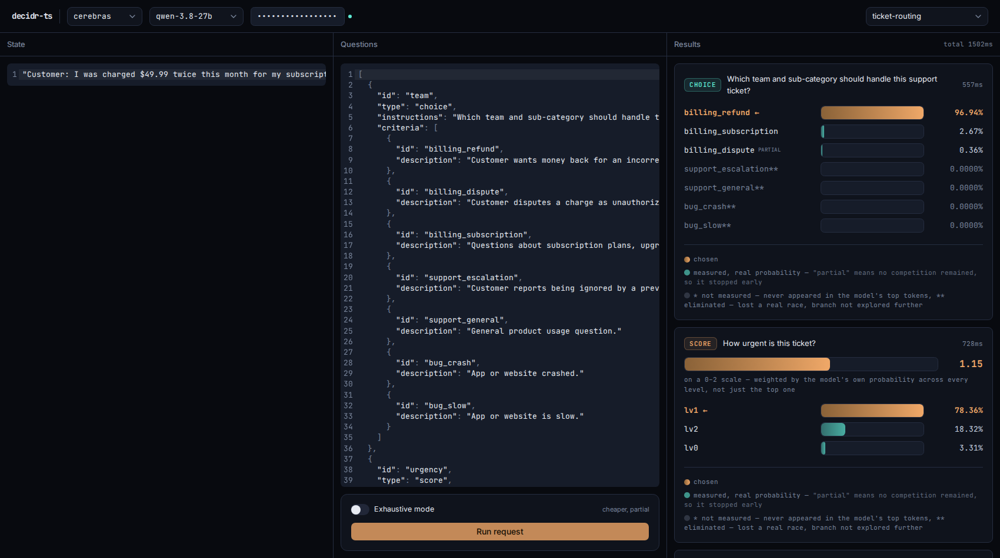
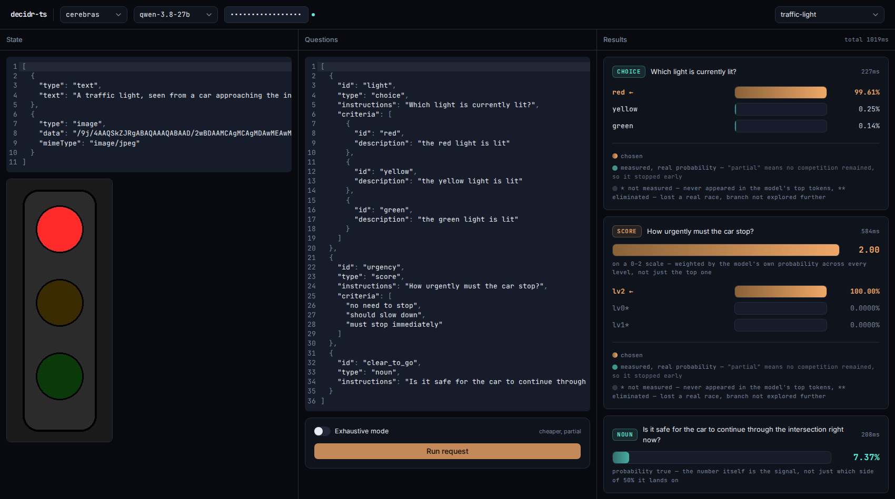

# decidr-ts: real LLM classification, scoring, and yes/no decisions in TypeScript

**Structured LLM output without JSON parsing, retries, or prompt
engineering.** decidr-ts reads a real probability straight off the
model's own logits for a question you define -- pick the best option
from a list (**Choice**), grade something on a rubric (**Score**), or
get a calibrated yes/no (**Noun**) -- in one forward pass, with no
generated text to parse and nothing that can come back malformed.

If you're building ticket routing, intent classification, content
moderation, agent-task dispatch, or any place your code currently does
`JSON.parse(llm_response)` and hopes for the best, this replaces that
call with a typed result and a real confidence number.

- **Real probabilities, not self-reported confidence.** `decision.probabilities`
  is a softmax over the model's own next-token logprobs -- not the model
  being asked to guess its own confidence in text, which is a well-known
  unreliable signal.
- **Works today against real, verified providers** -- OpenAI, Cerebras,
  Together AI, self-hosted vLLM, and any local Ollama model -- checked
  live against each provider's own docs, not assumed (see
  [PROVIDERS.md](docs/PROVIDERS.md)).
- **Fast.** No generation, no retries on malformed JSON. Measured live:
  as fast as ~165ms end-to-end on Cerebras for a real classification
  call -- see [Benchmarks](#benchmarks).
- **[Try it live](https://devanmolsharma.github.io/decidr-ts/)** -- a
  real in-browser playground, no signup: paste your own API key, pick an
  example, run a real request, see the real numbers come back.

This is the TypeScript port of [decidr](https://github.com/devanmolsharma/decidr)
(Python, on PyPI as `decidr`). Same mechanism, same id rules, same
hierarchy resolution -- ported line-for-line where JS/TS allowed it to
stay faithful, adapted where it didn't (see [Porting notes](#porting-notes)).

## Install

```bash
npm install decidr-ts
```

Node 18+. One dependency: the official [`openai`](https://www.npmjs.com/package/openai) SDK -- see [Backends](#backends) for why a real dependency was chosen over hand-rolled HTTP, and [SPEC.md §3.2](docs/SPEC.md#32-reference-backend-implementation-strategy-official-per-provider-sdks-never-a-multi-provider-abstraction) for the researched reasoning behind it.

## Quickstart: local model via Ollama

```ts
import { Client } from "decidr-ts";

const client = new Client("qwen3.5:4b"); // any Ollama model -- Client() talks to Ollama's
                                          // OpenAI-compatible endpoint at http://127.0.0.1:11434/v1 by default

const decision = await client.decide({
  id: "ticket-42",
  state: "Customer: my card was charged twice for the same order, please refund the extra charge.",
  question: "What category does this support ticket belong to?",
  options: [
    { id: "billing_refund", description: "customer wants money back" },
    { id: "billing_dispute", description: "customer disputes a charge as unauthorized/fraud" },
    { id: "bug_crash", description: "app or site crashed" },
    { id: "bug_slow", description: "app or site is slow" },
    { id: "account_login", description: "trouble logging in" },
  ],
});

decision.choice;          // "billing_refund"
decision.probabilities;   // Map<string, number>, one entry per option actually compared
decision.unscored;        // option ids that genuinely couldn't be measured -- real gaps
decision.eliminated;      // ids under a losing branch that weren't individually explored (not a gap)
```

## Quickstart: hosted model via OpenAI (or anything OpenAI-compatible)

```ts
import { Client, OpenAIBackend } from "decidr-ts";

const client = new Client("gpt-4o", {
  backend: new OpenAIBackend({ apiKey: process.env.OPENAI_API_KEY }),
});

const decision = await client.decide(row);
```

`OpenAIBackend` talks to any server that speaks the OpenAI
`/v1/chat/completions` wire format -- pass `baseURL` to point it at a
self-hosted or third-party endpoint instead of `https://api.openai.com/v1`.
This is also what the default `Client()` above uses under the hood, just
pointed at a local Ollama instead.

**Only some models support `logprobs`.** Standard chat models (the GPT-4o
family and similar) do. Reasoning models (the o-series and similar
reasoning models elsewhere) do not -- `decide()` will fail with a clear
error if you point it at one.

## Three primitives: Choice, Score, Noun

`decide()` (above) is the **Choice** primitive: pick the best option from
a fixed set of ids. Two more primitives are built on top of it, same
mechanism, different response shape:

```ts
// Score: place the state on an ordered rubric, low to high.
const severity = await client.score({
  id: "bug-1",
  state: "The bug crashes the whole app for every user, no workaround.",
  question: "How severe is this bug?",
  levels: [
    { id: "cosm", description: "cosmetic" },
    { id: "mod", description: "moderate" },
    { id: "crit", description: "critical" },
  ],
});
severity.score; // e.g. 1.95 -- a probability-weighted position on [0, 2],
                // not just the top level's index
severity.decision; // the underlying Decision, same probabilities/eliminated/etc

// Noun: a single true/false probability -- the number itself is the signal.
const critical = await client.truth({
  id: "bug-1",
  state: "The bug crashes the whole app for every user, no workaround.",
  question: "Is this bug a critical severity issue?",
});
critical.truth; // e.g. 0.9862 -- read the same way confidence() is read
                // elsewhere: the probability IS the answer, not just
                // which side of 0.5 it lands on
```

Both are ordinary `decide()` calls under the hood (`score` races the
levels as options and computes a weighted index; `truth` races a fixed
`"true"`/`"false"` pair) -- same id-format rules, same `unscored`/
`eliminated`/`stoppedEarly` semantics apply to the underlying `Decision`
either way.

## How option ids work

Options are identified by real, human-readable ids, not letters (`A`/`B`/`C`).
The model reads and answers with the id itself, and the id's structure
does double duty as your category hierarchy:

- Ids are lowercase alphanumeric segments joined by underscores:
  `billing_refund`, `bug_crash`, `account_login_2fa`.
- An id can't be a segment-prefix of another id in the same option set
  (`billing` and `billing_refund` together are rejected -- ambiguous).
- Segments are used as a literal tree. `billing_refund` and
  `billing_dispute` both live under a `billing` node; deciding which
  applies is two small races (`billing` vs `bug` vs `account`, then
  `refund` vs `dispute`) instead of one large unreliable race over every
  leaf id at once. This is why option ids need to be *meaningful*
  hierarchical names, not arbitrary labels.

By default, **every branch of the hierarchy is explored**
(`exhaustive: true`), so every option ends up with a real, comparable
probability -- more requests, better numbers. Set `exhaustive: false` to
only pay for the winning path; ids under branches that lost but weren't
explored further show up in `decision.eliminated`, not
`decision.probabilities`.

```ts
const client = new Client("qwen3.5:4b", { exhaustive: false });
```

Separately from `exhaustive`, decidr-ts also stops walking an individual
option's id the moment it's the only candidate left racing for its
current prefix -- there's nothing else it could still be confused with,
so paying for more requests to spell out the rest of its id isn't worth
it by default. That option is still scored (it's in
`decision.probabilities`, not `decision.unscored`) and shows up in
`decision.stoppedEarly`, but on a partial rather than a full
log-probability -- see [PREFIX_MATCHING.md](docs/PREFIX_MATCHING.md#stopping-early-the-actual-default)
for what that trades away. Measured live: an 8-option race with several
similar ids went from 5 requests to 1.

## Backends

`OpenAIBackend`, built on the official `openai` SDK, is the only
backend -- and it's enough. It talks to any OpenAI-compatible
`/v1/chat/completions` endpoint: OpenAI itself, Ollama's own
OpenAI-compatible endpoint (verified live to return real, correct
`logprobs` -- see [docs/SPEC.md §3.2](docs/SPEC.md#32-reference-backend-implementation-strategy-official-per-provider-sdks-never-a-multi-provider-abstraction)
for why an earlier assumption that it didn't was wrong), and other
OpenAI-compatible hosts confirmed to forward `logprobs` correctly (see
[PROVIDERS.md](docs/PROVIDERS.md)). There is deliberately no separate
Ollama-specific backend or multi-provider abstraction layer --
[PROVIDERS.md](docs/PROVIDERS.md#gateways-and-unified-multi-provider-clients-none-solve-this-reliably)
has the full researched reasoning for why every general-purpose
multi-provider client checked (LiteLLM, OpenRouter, Vercel AI SDK,
LangChain, and others) has a silent or structural logprobs gap for at
least one major provider.

You can write your own backend for another provider by implementing the
same shape `Client` calls -- there's no base class to extend, just three
methods:

```ts
import type { Backend, ChatMessage, ChatResult } from "decidr-ts";

class MyBackend implements Backend {
  async chat(model: string, messages: ChatMessage[], maxTokens = 1): Promise<ChatResult> {
    // return { content, logprobs } in the shape documented on Backend.chat
  }
  async warmup(model: string): Promise<void> { /* pre-warm a connection, or no-op */ }
  async discoverTokensBatch(model: string, words: string[]): Promise<Map<string, string[]>> {
    // see docs/SPEC.md §8 for the default algorithm to mirror, or delegate to chat()
  }
}
```

## Latency

Against a hosted API, a cold connection (fresh TLS handshake) is the
single biggest cost you actually control -- measured live against
OpenAI, a cold request took ~2.4s where a warm one on a reused
connection took ~0.75-1.0s. Node's global `fetch` already pools
keep-alive connections per host, so the fix is simple: warm the
connection, and (optionally) the id tokenization, before the
latency-sensitive call.

```ts
// Ahead of time, once the row's options are known:
await client.warmup(row); // pre-warms the connection AND discovers each
                           // option id's real token boundaries, seeding
                           // the speculative cache -- returns a real
                           // Decision, so this can just be your first call

// Later, on the hot path:
const decision = await client.decide(row); // faster: warm connection,
                                            // and (if warmup ran before)
                                            // every disambiguation round
                                            // fires from a verified guess
                                            // instead of a cold one
```

`warmup` never changes what `decide()` returns -- every speculative
guess it seeds is still verified against the real response before being
trusted (see [PREFIX_MATCHING.md](docs/PREFIX_MATCHING.md)). It only
changes how fast the answer arrives. Realistic floors, not sub-100ms
promises: hosted OpenAI is bounded by its own server-side latency
(published best case ~0.7s TTFT) regardless of client tuning; a local
Ollama model has no such floor. `Client`'s `cache` option controls the
underlying speculative cache (on by default, persisted to
`~/.decidr-ts/token-cache.json`) -- pass `cache: false` to disable it.

## Benchmarks

Measured live, 3 runs each, `exhaustive: false` unless noted -- not
cherry-picked, this is the actual spread including warm-up variance:

| Row | Provider / model | Latency |
|---|---|---:|
| Flat, 4 options | Cerebras `qwen-3.8-27b` | 165–339ms |
| Flat, 4 options | OpenAI `gpt-4o-mini` | 817–2164ms |
| Hierarchical, 7 options (1 level) | Cerebras `qwen-3.8-27b` | 349–721ms |
| Hierarchical, 7 options (1 level) | OpenAI `gpt-4o-mini` | 1177–1481ms |
| Hierarchical, 7 options, `exhaustive: true` | Cerebras `qwen-3.8-27b` | 343–641ms |
| Hierarchical, 7 options, `exhaustive: true` | OpenAI `gpt-4o-mini` | 1324–2325ms |
| `Client.score`, 3 levels | Cerebras `qwen-3.8-27b` | 172–285ms |
| `Client.truth` | Cerebras `qwen-3.8-27b` | 163–409ms |

Cerebras's specialized inference hardware is consistently 2–6x faster
than a general hosted API on identical requests, at identical accuracy
(same `logprobs`-based mechanism, same measured probabilities either
way) -- see the [webui playground](examples/webui/) for a live, in-browser
version of these same numbers, screenshots below. `qwen-3.8-27b` is
currently the only (and smallest) model on Cerebras's public inference
API -- checked live, not assumed.





## What would make this even faster

The main thing standing between decidr-ts and even lower latency isn't
in this library's code -- it's a limit every provider imposes on the API
itself. When asking the model "which of these options fits best," the
API only ever hands back a short list of its top candidate answers (20,
on every provider checked -- see [PROVIDERS.md](docs/PROVIDERS.md)), not
its full opinion across everything you offered it. With a short list of
options that's plenty. With a long one, decidr-ts has to ask a couple of
smaller, more targeted questions instead of one big one, to make sure
every option still gets a fair, real measurement.

**If providers exposed a larger list of candidate answers per request,**
decidr-ts would need fewer of those follow-up questions -- most requests
would resolve in a single round-trip regardless of how many options
you're choosing between, which means lower latency and fewer API calls,
automatically, with no changes needed here. This is entirely a provider
product decision, not a decidr-ts roadmap item -- self-hosted inference
(vLLM) already removes this limit today if you're willing to run your
own model instead of a hosted API.

## Calibration

`decision.probabilities` are real softmax'd logprobs, not hand-waved
confidence scores -- but "real" doesn't automatically mean "calibrated."
`fitTemperature` finds one scalar temperature that rescales them to
better match actual outcomes, and reports Expected Calibration Error
(ECE) before/after so you can see the improvement rather than assume it:

```ts
import { fitTemperature, evaluateOutOfFold } from "decidr-ts";

// pairs: [{ decision, correctId }, ...] from decisions you've verified
const result = fitTemperature(pairs);
result.temperature; // apply this to Client's `temperature` option
result.eceBefore;
result.eceAfter;

// cross-validated, so the reported improvement isn't overfit to the sample
const oof = evaluateOutOfFold(pairs, 5);
```

## Porting notes

Differences from the Python library, and why:

- **Stops early by default.** The biggest behavioral divergence: Python
  always walks every option's id to full completion before scoring it,
  for strict comparability across options resolved at different depths.
  decidr-ts stops the moment an option has no more competition for its
  current prefix, trading that strict comparability for far fewer
  requests -- see [PREFIX_MATCHING.md](docs/PREFIX_MATCHING.md#stopping-early-the-actual-default).
  There's currently no flag to opt back into Python's behavior in
  decidr-ts; use the Python library if that guarantee matters more to
  you than request count.
- **Backends.** Python ships `OllamaBackend` (stdlib only, hand-rolled
  HTTP) and `LiteLLMBackend` (optional extra). The TS port ships a single
  `OpenAIBackend`, built on the official `openai` SDK, that reaches
  Ollama too (via its OpenAI-compatible endpoint) -- see
  [Backends](#backends) above and [docs/SPEC.md §3.2](docs/SPEC.md#32-reference-backend-implementation-strategy-official-per-provider-sdks-never-a-multi-provider-abstraction)
  for the full researched reasoning. This means decidr-ts is not
  dependency-free the way its Python counterpart's default path is --
  a deliberate tradeoff of one real, well-maintained dependency (with
  official logprobs typing, retries, and error handling) over hand-rolled
  HTTP, made after directly verifying that no lighter-weight
  multi-provider alternative actually returns logprobs reliably.
- **Ordered collections.** Python dicts preserve insertion order
  unconditionally. JavaScript's plain objects reorder integer-like string
  keys (e.g. `"2"`) ahead of insertion order regardless of when they were
  added -- and an id segment can be purely numeric under the id format
  rules. The TS port uses `Map` everywhere order matters (the id tree's
  children, token-matching groups, `Decision.probabilities`/`logprobs`)
  to avoid that class of bug outright.
- **No `letters` mode.** Removed in the Python library once hierarchy
  resolution made it redundant; never existed in this port.
- **Calibration's seeded shuffle.** Python's `evaluate_out_of_fold` uses
  `random.Random(seed)`. Node has no built-in seeded RNG, so the port
  uses a small hand-rolled PRNG (mulberry32) for the same purpose --
  reproducible for a given seed, but not bit-identical to Python's
  Mersenne Twister output.

## Docs

- [SPEC.md](docs/SPEC.md) — the full implementation specification: precise enough for a clean-room reimplementation in any language
- [PREFIX_MATCHING.md](docs/PREFIX_MATCHING.md) — how a multi-token id gets scored from raw logprobs
- [HIERARCHY.md](docs/HIERARCHY.md) — why option ids form a real tree, and the `exhaustive` tradeoff
- [NAMING_IDS.md](docs/NAMING_IDS.md) — the id format rules and why each one exists
- [PROVIDERS.md](docs/PROVIDERS.md) — worked examples for Ollama, OpenAI, and other OpenAI-compatible servers, plus the full checked provider matrix

## License

MIT
